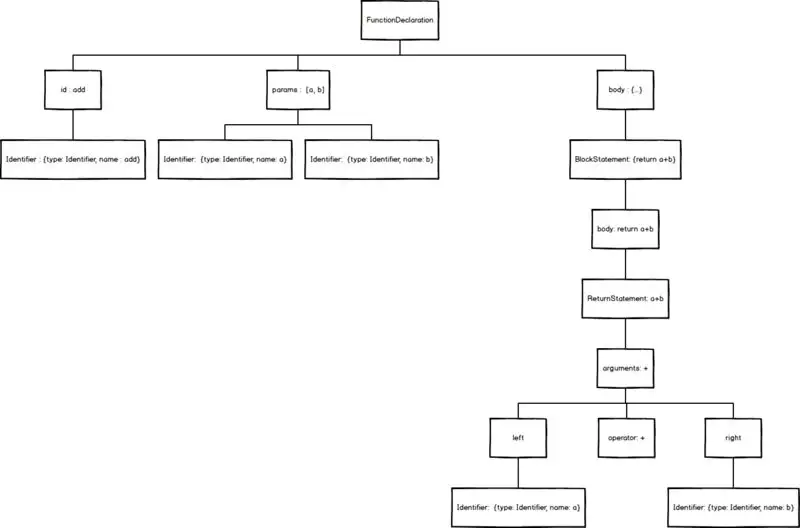

**一个简单的实例**

```javascript
function add(a,b){
  return a+b
}
```
这个函数在ast中叫做`functionDeclation`(函数定义)对象。我们拆开它：
* 一个id,是他的名字
* 两个params，是他的参数，即[a,b]
* 一块body，也就是大括号的里面的`blockStatements`

**拆开id:**
```javascript
{
  type:Identifier,
  name:add,
  ...
}
```


**拆开params:**

```javascript
// 其实是两个Identifier组成的数组
{
  type:Identifier,
  name:a,
  ...
}

{
  type:Identifier,
  name:b,
  ...
}

```

***重点看来了：***

我们来拆分`body`:

`body`是一个大括号包裹起来的，其实是一个`BlockStatement`(块状域)，用来表示`return {a + b}`

继续拆分`BlockStatement`,我们发现是一个`returnStatement`（Return域）对象，用来表示`return a + b` 

再次拆分，里面是一个`BinaryExpression`(二项式)对象，用来表示`a + b`

最后我们打开二项式，它成了3个部分。left，operator，right


示意图表示为：




**AST工具：recast**


